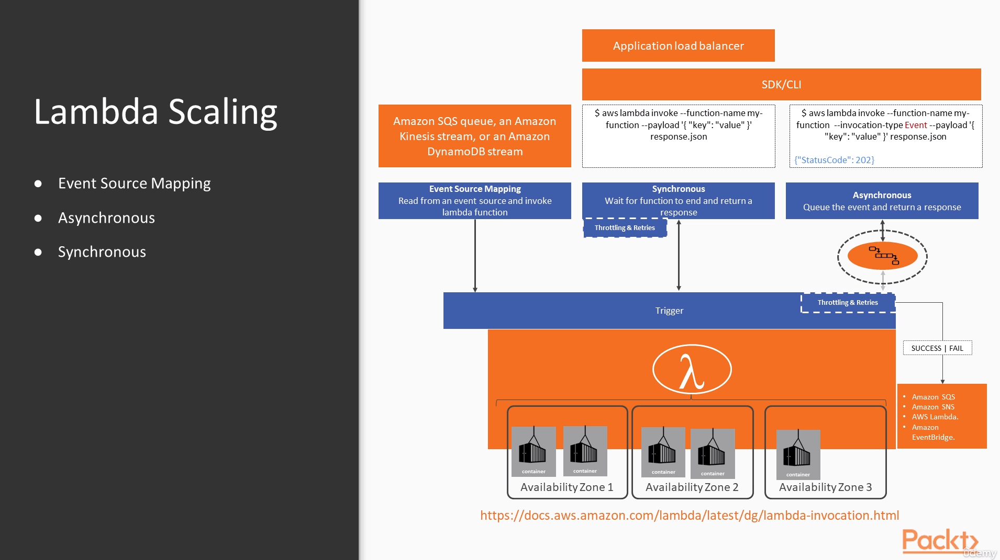

# SRE om AWS

## Section 1: The basics of Site Realiability Engineering
### Intro

Repo: https://github.com/mt2h/Site-Reliability-Engineering-on-AWS

### Reability in Moder Applications

### The impact of Failure and Determinating Your Realiability Objetives

### Accepting Failure and Making It Part of the Design Process

### SRE is a Mindset

## Section 2: Gaining Resilence and Realiability on AWS

### AWS Global, Regional and Zonal Architecture Design

### Amazon's Global Storage Service - S3

### Running Resilient Databases on AWS - RDS and DynamoDB

### Fault Tolerant Computation on AWS - Lamba and EC2

### Core Resilience Principles for AWS - Load Balacing and Auto Scaling

### Using Kubernetes and ECS on AWS

