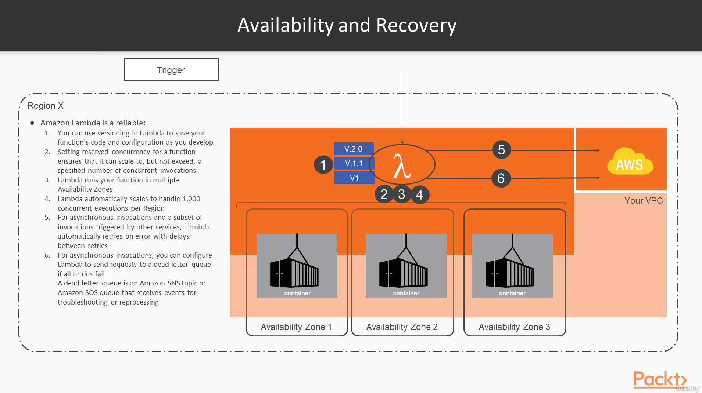
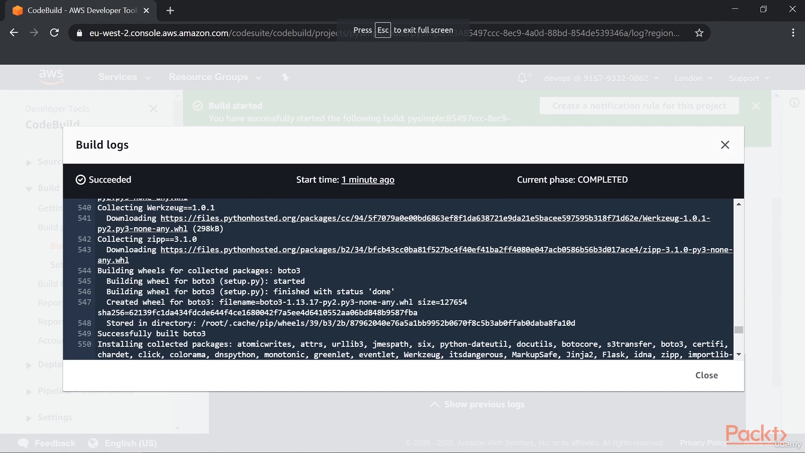
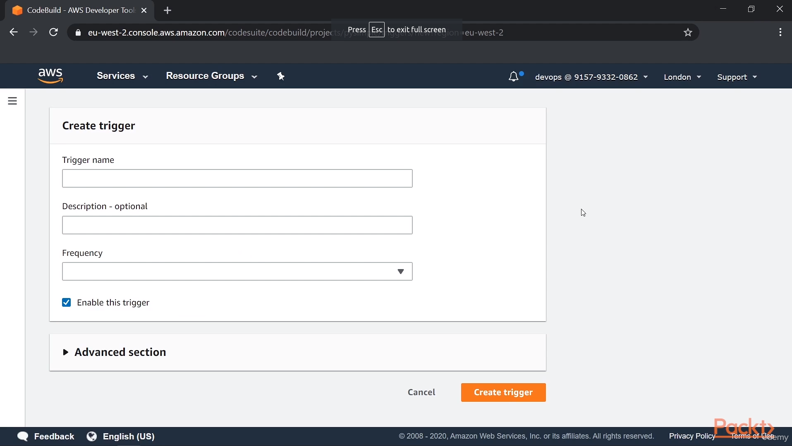

# SRE om AWS

## Section 1: The basics of Site Realiability Engineering
### Intro

Repo: https://github.com/mt2h/Site-Reliability-Engineering-on-AWS

### Reability in Moder Applications

### The impact of Failure and Determinating Your Realiability Objetives

### Accepting Failure and Making It Part of the Design Process

### SRE is a Mindset

## Section 2: Gaining Resilence and Realiability on AWS

### AWS Global, Regional and Zonal Architecture Design

### Amazon's Global Storage Service - S3

### Running Resilient Databases on AWS - RDS and DynamoDB

### Fault Tolerant Computation on AWS - Lamba and EC2

### Core Resilience Principles for AWS - Load Balacing and Auto Scaling

### Using Kubernetes and ECS on AWS

## Section 3: Accepting Failure in Multi-Tier Applications

### Typical Three-Tier Application Resilience and Why it fails in Cloud

### Desinging in Resilience with Microservices

### Managing State

Un proxy de Amazon RDS (Relational Database Service) es una herramienta que permite administrar conexiones a bases de datos de Amazon RDS y Aurora de manera eficiente y segura. Los microservicios son una arquitectura de desarrollo de aplicaciones en la que las aplicaciones se dividen en componentes más pequeños e independientes llamados microservicios. Usar un proxy RDS en esta arquitectura puede proporcionar varios beneficios:

Administración de conexiones: En una arquitectura de microservicios, múltiples microservicios pueden necesitar acceder a la misma base de datos. Un proxy RDS puede administrar y gestionar de manera centralizada las conexiones a la base de datos, evitando la necesidad de que cada microservicio maneje su propia conexión. Esto reduce la sobrecarga en la base de datos y mejora el rendimiento.

Escalabilidad y elasticidad: Un proxy RDS puede manejar automáticamente la escalabilidad y la elasticidad de las conexiones a la base de datos. A medida que el número de microservicios o la carga de trabajo aumenta, el proxy puede ajustar la cantidad de conexiones disponibles para garantizar un rendimiento óptimo y evitar la saturación de la base de datos.

Seguridad: El proxy RDS actúa como un punto de entrada controlado a la base de datos. Puede implementar autenticación y autorización, lo que significa que solo los microservicios autorizados pueden acceder a la base de datos a través del proxy. Esto refuerza la seguridad y protege la base de datos de accesos no autorizados.

Aislamiento: Los microservicios pueden aislarse de los detalles de conexión y configuración de la base de datos subyacente. El proxy puede manejar la administración de conexiones, el almacenamiento en caché de consultas y otros aspectos técnicos, permitiendo que los equipos de desarrollo se centren en la lógica de negocio y no en los detalles de implementación de la base de datos.

Monitorización y análisis: Un proxy RDS puede proporcionar métricas y registros de rendimiento de las consultas realizadas por los microservicios. Esto permite a los equipos de operaciones y desarrollo monitorear y analizar el rendimiento de las consultas, identificar cuellos de botella y optimizar el acceso a la base de datos.

En resumen, usar un proxy RDS en una arquitectura de microservicios en AWS puede ayudar a optimizar el rendimiento, la escalabilidad, la seguridad y la administración de conexiones a la base de datos, permitiendo a los equipos de desarrollo concentrarse en la funcionalidad de los microservicios en lugar de preocuparse por los detalles de la conexión y gestión de la base de datos.

### Typical Application Realiability Patterns

En el contexto de los microservicios y la disciplina de Site Reliability Engineering (SRE), un "circuit breaker" (interruptor de circuito) es un patrón de diseño que se utiliza para mejorar la resiliencia y la estabilidad de un sistema distribuido. Su función principal es prevenir que un servicio siga enviando solicitudes a un servicio remoto (ya sea otro microservicio, una base de datos, API externa, etc.) que está experimentando problemas o fallas. Esto se hace para evitar una carga excesiva en el servicio remoto y para proteger la integridad del sistema en su conjunto.

El nombre "circuit breaker" proviene de una analogía con los interruptores eléctricos en una casa. Al igual que un interruptor de circuito se abre automáticamente para evitar daños en el sistema eléctrico cuando hay un cortocircuito o una sobrecarga, un circuit breaker en el contexto de la arquitectura de microservicios "abre" temporalmente la conexión con un servicio remoto cuando se detecta un fallo, evitando así que más solicitudes se envíen hasta que el problema se resuelva.

El patrón de circuit breaker generalmente opera de la siguiente manera:

1. **Estado cerrado (Closed)**: En este estado, el circuit breaker permite que las solicitudes fluyan normalmente entre el servicio y el servicio remoto. Se monitorea constantemente la tasa de errores o respuestas fallidas. Si la tasa de errores supera un umbral predefinido, el circuit breaker se activa y cambia al siguiente estado.

2. **Estado abierto (Open)**: Una vez que se supera el umbral de errores, el circuit breaker se abre. En este estado, el circuito está "abierto" y todas las solicitudes subsiguientes al servicio remoto se bloquean temporalmente. Esto evita que el servicio siga enviando solicitudes a un componente que está fallando, lo que podría empeorar la situación.

3. **Estado semi-abierto (Half-Open)**: Después de un período de tiempo definido, el circuit breaker pasa al estado semi-abierto. En este estado, se permite pasar una pequeña cantidad de solicitudes al servicio remoto para probar si el problema se ha resuelto. Si estas solicitudes son exitosas y no se observan más errores, el circuit breaker regresa al estado cerrado. Si persisten los problemas, vuelve al estado abierto.

El patrón de circuit breaker es una parte fundamental de la estrategia de resiliencia en arquitecturas de microservicios y SRE, ya que ayuda a prevenir la propagación de problemas y permite que los sistemas se recuperen de manera más efectiva. También es útil para gestionar la carga durante picos de tráfico o caídas temporales de componentes.

En el contexto de la arquitectura de microservicios y la ingeniería de confiabilidad del sitio (SRE), el patrón de diseño de "bulkhead" (mamparo o compartimentación) se utiliza para mejorar la resiliencia de un sistema distribuido al aislar componentes y limitar el impacto de las fallas. Este patrón toma su nombre de las divisiones resistentes en un barco llamadas "bulkheads" que previenen que el agua ingrese a otras secciones en caso de colisión o daño.

En términos simples, un bulkhead implica separar diferentes partes de un sistema para evitar que la falla o el colapso de una sección afecte negativamente a las otras secciones. Esto se logra al asignar recursos y limitar la capacidad de cada componente, de manera que si un componente falla o experimenta una sobrecarga, las demás partes del sistema no se vean perjudicadas.

Un ejemplo práctico de bulkheads en una arquitectura de microservicios es el uso de pools de conexiones separados para diferentes microservicios que acceden a bases de datos. Si un microservicio experimenta un aumento repentino de tráfico y agota sus conexiones en el pool, no afectará la capacidad de otros microservicios para acceder a la base de datos, ya que cada microservicio tiene su propio pool de conexiones aislado.

En resumen, el patrón de bulkhead se trata de crear compartimentos aislados en un sistema distribuido para limitar el alcance de las fallas y mejorar la resistencia general del sistema. Esto es especialmente útil en microservicios y SRE para mitigar el impacto de los fallos y garantizar que el rendimiento y la disponibilidad de todo el sistema no se vean comprometidos por problemas en un componente específico.

### The Architecture of our example microservices

AWS X-Ray es un servicio proporcionado por Amazon Web Services (AWS) que se utiliza para rastrear y analizar el flujo de solicitudes a través de aplicaciones distribuidas y en la nube. Es especialmente útil en el contexto de arquitecturas de microservicios y sistemas basados en la nube, donde múltiples componentes interactúan para cumplir con una solicitud. X-Ray permite a los desarrolladores y equipos de operaciones visualizar y analizar cómo se comportan estas solicitudes a medida que atraviesan diferentes servicios.

En el contexto de la malla de aplicaciones (application mesh), que es un conjunto de servicios interconectados que colaboran para ofrecer una aplicación, X-Ray se utiliza para rastrear y registrar información sobre cada paso de una solicitud a medida que viaja a través de los diferentes servicios en la malla. Algunos de los conceptos clave de cómo X-Ray rastrea la malla de aplicaciones incluyen:

1. **Segmentos y subsegmentos**: X-Ray divide una solicitud en segmentos, que representan un componente de la aplicación, como un microservicio. Cada segmento puede contener subsegmentos para desglosar aún más las operaciones internas dentro de ese componente.

2. **Traza de solicitud**: X-Ray crea una "traza" que muestra el recorrido completo de una solicitud a medida que atraviesa diferentes segmentos y subsegmentos. Esto permite a los equipos identificar cuellos de botella, retrasos o problemas en el flujo de la solicitud.

3. **Tiempo y latencia**: X-Ray registra el tiempo que lleva cada segmento y subsegmento para procesar una solicitud. Esto ayuda a identificar áreas donde se está produciendo una latencia significativa.

4. **Mapa de servicio**: X-Ray genera un mapa visual de los componentes de la aplicación y sus relaciones, lo que ayuda a comprender la topología de la malla de aplicaciones y cómo se conectan los diferentes servicios.

5. **Información de contexto**: X-Ray permite agregar metadatos y etiquetas personalizadas a los segmentos y subsegmentos para proporcionar información adicional sobre el contexto de la solicitud.

En resumen, AWS X-Ray es una herramienta poderosa para rastrear y analizar el flujo de solicitudes a través de aplicaciones distribuidas y mallas de aplicaciones. Ayuda a los equipos a identificar problemas de rendimiento, comprender las interacciones entre los servicios y mejorar la visibilidad en entornos complejos de microservicios y arquitecturas basadas en la nube.

## Deploying Py-Simple on AWS

### Optimizing and Migratingf Our Code

- Repo Project Code: https://github.com/mt2h/Site-Reliability-Engineering-on-AWS/tree/master/packt-sre-code/packt-sre/pysimple

- Helper AWS to Create Custom Metrics in AWS: https://github.com/mt2h/Site-Reliability-Engineering-on-AWS/blob/master/packt-sre-code/packt-sre/pysimple/carLister/awsHelper.py

- Use custom Metrics SLI: https://github.com/mt2h/Site-Reliability-Engineering-on-AWS/blob/master/packt-sre-code/packt-sre/pysimple/carLister/main.py

- Repo IAC for CodeCommit: https://github.com/mt2h/Site-Reliability-Engineering-on-AWS/tree/master/packt-sre-code/packt-sre/IAC/1-codecommit 

After Terraform apply....

Clone repository from CodeCommit AWS

Push files to the repository

### Creating our Container with CodeBuild

Repo Create CodeBuild: https://github.com/mt2h/Site-Reliability-Engineering-on-AWS/tree/master/packt-sre-code/packt-sre/IAC/2-codebuild

Repo Create ECR: https://github.com/mt2h/Site-Reliability-Engineering-on-AWS/tree/master/packt-sre-code/packt-sre/IAC/3-ecr

Pipeline: https://github.com/mt2h/Site-Reliability-Engineering-on-AWS/blob/master/packt-sre-code/packt-sre/build/buildspec.yml

### Deploying ECS and RDS

Repo Create RDS: https://github.com/mt2h/Site-Reliability-Engineering-on-AWS/tree/master/packt-sre-code/packt-sre/IAC/4-rds

Repo Create Load Balancer And ECS: https://github.com/mt2h/Site-Reliability-Engineering-on-AWS/tree/master/packt-sre-code/packt-sre/IAC/5-ecs