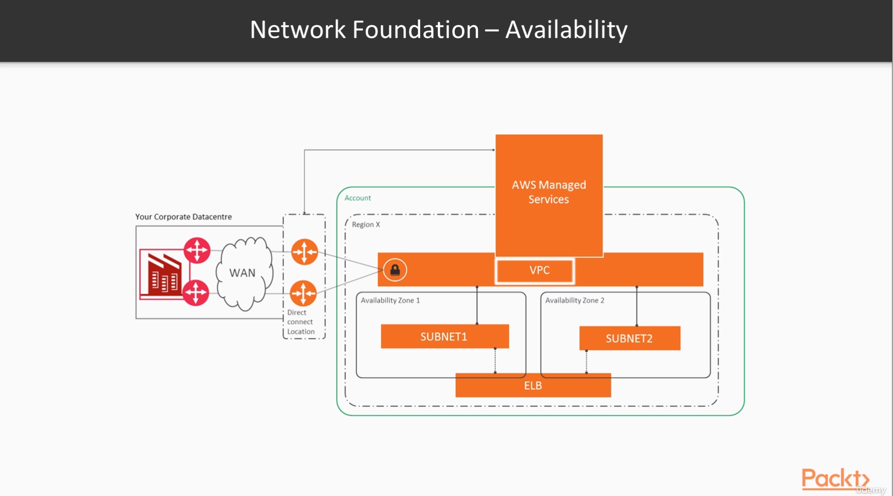
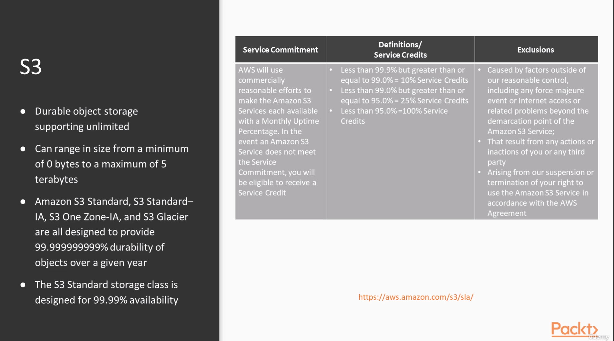

# SRE om AWS

## Section 1: The basics of Site Realiability Engineering
### Intro

Repo: https://github.com/mt2h/Site-Reliability-Engineering-on-AWS

### Reability in Moder Applications

### The impact of Failure and Determinating Your Realiability Objetives

### Accepting Failure and Making It Part of the Design Process

### SRE is a Mindset

## Section 2: Gaining Resilence and Realiability on AWS

### AWS Global, Regional and Zonal Architecture Design

### Amazon's Global Storage Service - S3

### Running Resilient Databases on AWS - RDS and DynamoDB

### Fault Tolerant Computation on AWS - Lamba and EC2

### Core Resilience Principles for AWS - Load Balacing and Auto Scaling

### Using Kubernetes and ECS on AWS

## Section 3: Accepting Failure in Multi-Tier Applications

### Typical Three-Tier Application Resilience and Why it fails in Cloud

### Desinging in Resilience with Microservices

## Managing State

Un proxy de Amazon RDS (Relational Database Service) es una herramienta que permite administrar conexiones a bases de datos de Amazon RDS y Aurora de manera eficiente y segura. Los microservicios son una arquitectura de desarrollo de aplicaciones en la que las aplicaciones se dividen en componentes más pequeños e independientes llamados microservicios. Usar un proxy RDS en esta arquitectura puede proporcionar varios beneficios:

Administración de conexiones: En una arquitectura de microservicios, múltiples microservicios pueden necesitar acceder a la misma base de datos. Un proxy RDS puede administrar y gestionar de manera centralizada las conexiones a la base de datos, evitando la necesidad de que cada microservicio maneje su propia conexión. Esto reduce la sobrecarga en la base de datos y mejora el rendimiento.

Escalabilidad y elasticidad: Un proxy RDS puede manejar automáticamente la escalabilidad y la elasticidad de las conexiones a la base de datos. A medida que el número de microservicios o la carga de trabajo aumenta, el proxy puede ajustar la cantidad de conexiones disponibles para garantizar un rendimiento óptimo y evitar la saturación de la base de datos.

Seguridad: El proxy RDS actúa como un punto de entrada controlado a la base de datos. Puede implementar autenticación y autorización, lo que significa que solo los microservicios autorizados pueden acceder a la base de datos a través del proxy. Esto refuerza la seguridad y protege la base de datos de accesos no autorizados.

Aislamiento: Los microservicios pueden aislarse de los detalles de conexión y configuración de la base de datos subyacente. El proxy puede manejar la administración de conexiones, el almacenamiento en caché de consultas y otros aspectos técnicos, permitiendo que los equipos de desarrollo se centren en la lógica de negocio y no en los detalles de implementación de la base de datos.

Monitorización y análisis: Un proxy RDS puede proporcionar métricas y registros de rendimiento de las consultas realizadas por los microservicios. Esto permite a los equipos de operaciones y desarrollo monitorear y analizar el rendimiento de las consultas, identificar cuellos de botella y optimizar el acceso a la base de datos.

En resumen, usar un proxy RDS en una arquitectura de microservicios en AWS puede ayudar a optimizar el rendimiento, la escalabilidad, la seguridad y la administración de conexiones a la base de datos, permitiendo a los equipos de desarrollo concentrarse en la funcionalidad de los microservicios en lugar de preocuparse por los detalles de la conexión y gestión de la base de datos.